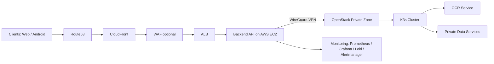

# UIT Healthcare - Hybrid Cloud Platform

> A production-oriented healthcare system using a **hybrid cloud architecture**: AWS for public traffic and OpenStack/K3s for private workloads.

[](https://github.com/hutusnov/healthcare/actions/workflows/deploy.yml)
[](https://github.com/hutusnov/healthcare/commits/main)
[](https://github.com/hutusnov/healthcare)
[](https://github.com/hutusnov/healthcare/stargazers)

## Table of Contents

- [What This Project Is](#what-this-project-is)
- [Services](#services)
- [High-Level Architecture](#high-level-architecture)
- [Tech Stack](#tech-stack)
- [Repository Layout](#repository-layout)
- [Delivery Pipeline (DevSecOps)](#delivery-pipeline-devsecops)
- [Reliability \& Operations](#reliability--operations)
- [Security Posture (Current)](#security-posture-current)
- [Project Status](#project-status)
- [Quick Links](#quick-links)

## What This Project Is

UIT Healthcare is an end-to-end platform that combines:
- public web/mobile access,
- secure backend APIs,
- OCR processing services,
- DevSecOps automation,
- and observability for real operations.

The system is designed to demonstrate how to split workloads across multiple clouds while keeping a clean public/private boundary.

## Services

### User-Facing Apps
- **Admin Panel** (React + Vite)
- **Patient Portal** (React + Vite)
- **Android App** (mobile client)

### Core Services
- **Backend API** (Node.js + Express + Prisma)
- **OCR Service** (FastAPI-based OCR pipeline)
- **Data Layer** (private-side database/message/cache services)

### Platform Services
- **CI/CD Pipeline** (GitHub Actions)
- **Monitoring & Logging** (Prometheus, Grafana, Loki, Promtail, Alertmanager)

## High-Level Architecture

### Architecture Diagram



### Traffic Path (Simplified)

```text
Clients (Web / Android)
        |
        v
Route53 -> CloudFront -> (optional WAF)
        |
        v
ALB -> Backend API on AWS (EC2, multi-AZ ready)
        |
        |  (WireGuard VPN tunnel)
        v
OpenStack Private Zone (K3s + OCR + Data Services)
```

### Why Hybrid?
- **AWS** handles public ingress and scalable delivery.
- **OpenStack** keeps private processing/data workloads isolated.
- **VPN** provides controlled cross-cloud communication.
- This model balances exposure, cost control, and security boundaries.

## Tech Stack

- **Backend**: Node.js, Express, Prisma
- **Frontend**: React, Vite
- **OCR**: Python, FastAPI
- **Containers/Orchestration**: Docker, K3s/Kubernetes
- **Cloud**: AWS, OpenStack
- **CI/CD & Security**: GitHub Actions, Semgrep, Trivy
- **Observability**: Prometheus, Grafana, Loki, Alertmanager

## Repository Layout

```text
.
|-- BACK-END/PROJECT-TEST/    # Backend API + admin-panel + patient-portal
|-- OCR/                      # OCR service
|-- APP-ANDROID/              # Android client
|-- deploy/                   # AWS/OpenStack deploy assets, monitoring, GitOps
|-- .github/workflows/        # CI/CD pipelines
`-- docs/                     # Build logs, guides, project notes
```

## Delivery Pipeline (DevSecOps)

The CI/CD flow includes:
1. **Validation** (backend/frontend/OCR checks)
2. **SAST & dependency checks**
3. **Container build + image scanning**
4. **Image publish (registry)**
5. **Automated deploy**
   - frontend to S3 + CloudFront
   - backend to AWS runtime
   - monitoring stack deployment

## Reliability & Operations

- Multi-instance backend deployment path for **HA/failover**
- Health checks through ALB target groups
- Centralized dashboards for metrics and logs
- Email alerts for critical conditions (e.g., backend down)

## Security Posture (Current)

- Public traffic is routed through edge layer (CloudFront/ALB)
- Direct-origin access can be restricted by verification policies
- Secrets handled via GitHub Secrets / runtime environment
- Pipeline security scanning before deployment

## Project Status

Implemented:
- Hybrid cloud baseline architecture
- Automated CI/CD pipeline
- Monitoring + alerting stack
- Multi-AZ backend deployment workflow

Planned next:
- Stronger GitOps reconciliation
- Deeper autoscaling and cost optimization
- Optional EKS migration path for backend runtime

## Quick Links

- [Deployment layout notes](deploy/README.md)
- [Hybrid build log](docs/OPENSTACK_3NODE_BUILD_LOG.md)
- [DevSecOps guide](docs/DEVSECOPS_GUIDE.md)

---

If you are reviewing this repository for architecture or DevOps capability, start with the **Architecture**, **Pipeline**, and **deploy/** directories.
