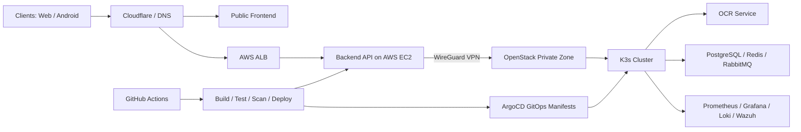

# UIT Healthcare - Hybrid Cloud DevSecOps Platform

> A production-oriented healthcare system using a **hybrid cloud architecture**: AWS for public ingress, OpenStack/K3s for private workloads, and a DevSecOps pipeline for build, scan, deploy, observe, and operate.

[](https://github.com/hutusnov/healthcare/actions/workflows/ci-backend.yml)
[](https://github.com/hutusnov/healthcare/actions/workflows/security-trivy.yml)
[](https://github.com/hutusnov/healthcare/actions/workflows/cd-backend.yml)
[](https://github.com/hutusnov/healthcare/actions/workflows/pipeline-unified.yml)
[](https://github.com/hutusnov/healthcare/commits/main)
[](https://github.com/hutusnov/healthcare)
[](https://github.com/hutusnov/healthcare/stargazers)

## Table of Contents

- [What This Project Is](#what-this-project-is)
- [Services](#services)
- [High-Level Architecture](#high-level-architecture)
- [Tech Stack](#tech-stack)
- [Repository Layout](#repository-layout)
- [Delivery Pipeline (DevSecOps)](#delivery-pipeline-devsecops)
- [Infrastructure as Code](#infrastructure-as-code)
- [Configuration Management](#configuration-management)
- [GitOps](#gitops)
- [Reliability \& Operations](#reliability--operations)
- [Security Posture (Current)](#security-posture-current)
- [Project Status](#project-status)
- [Quick Links](#quick-links)

## What This Project Is

UIT Healthcare is an end-to-end healthcare platform that combines:
- public web/mobile access,
- secure backend APIs,
- OCR processing for healthcare documents,
- infrastructure automation,
- GitOps deployment control,
- security scanning,
- monitoring, logging, alerting, and incident visibility.

The system demonstrates how to run a real application across public cloud and private cloud while keeping the public/private boundary explicit.

## Services

### User-Facing Apps
- **Admin Panel** (React + Vite)
- **Patient Portal** (React + Vite)
- **Android App** (native Android client)

### Core Services
- **Backend API** (Node.js + Express + Prisma)
- **OCR Service** (Python/FastAPI OCR pipeline)
- **Data Services** (PostgreSQL, Redis, RabbitMQ on private/runtime side)

### Platform Services
- **CI/CD Pipeline** (GitHub Actions)
- **GitOps Controller** (ArgoCD)
- **Infrastructure as Code** (Terraform for AWS/OpenStack)
- **Configuration Management** (Ansible)
- **Monitoring & Logging** (Prometheus, Grafana, Loki, Promtail, Alertmanager)
- **Security Monitoring** (Wazuh)

## High-Level Architecture

### Architecture Diagram


```mermaid
flowchart LR
    A["Clients: Web / Android"] --> B["Cloudflare / DNS"]
    B --> C["Public Frontend"]
    B --> D["AWS ALB"]
    D --> E["Backend API on AWS EC2"]
    E -->|"WireGuard VPN"| F["OpenStack Private Zone"]
    F --> G["K3s Cluster"]
    G --> H["OCR Service"]
    G --> I["PostgreSQL / Redis / RabbitMQ"]
    G --> J["Prometheus / Grafana / Loki / Wazuh"]
    K["GitHub Actions"] --> L["Build / Test / Scan / Deploy"]
    L --> E
    L --> M["ArgoCD GitOps Manifests"]
    M --> G
```

### Traffic Path (Simplified)

```text
Clients (Web / Android)
        |
        v
Cloudflare / DNS / Public Edge
        |
        v
AWS ALB -> Backend API on AWS EC2
        |
        |  (WireGuard VPN tunnel)
        v
OpenStack Private Zone (K3s + OCR + Data Services + Monitoring)
```

### Why Hybrid?
- **AWS** handles public ingress, backend entrypoint, and internet-facing availability.
- **OpenStack** keeps private processing, OCR, data services, and lab workloads isolated.
- **WireGuard** provides controlled cross-cloud connectivity.
- **GitOps + IaC** keep deployment and infrastructure changes reviewable.
- This model balances exposure, cost control, operational visibility, and security boundaries.

## Tech Stack

- **Backend**: Node.js, Express, Prisma
- **Frontend**: React, Vite
- **Mobile**: Android, Gradle/Kotlin build system
- **OCR**: Python, FastAPI
- **Containers/Orchestration**: Docker, Docker Compose, K3s/Kubernetes
- **Cloud**: AWS, OpenStack
- **IaC/Config**: Terraform, Ansible
- **GitOps**: ArgoCD, Kustomize manifests
- **CI/CD & Security**: GitHub Actions, SonarCloud, Trivy, OWASP ZAP, Gitleaks-ready workflow model
- **Observability**: Prometheus, Grafana, Loki, Promtail, Alertmanager, Wazuh
- **Load Testing**: k6

## Repository Layout

```text
.
|-- BACK-END/PROJECT-TEST/        # Backend API, admin-panel, patient-portal
|-- OCR/                          # OCR service and model assets
|-- APP-ANDROID/                  # Android client
|-- deploy/                       # Runtime deploy assets, monitoring, GitOps, ArgoCD
|-- infra/
|   |-- terraform/                # AWS Terraform modules and envs
|   |-- terraform-openstack/      # OpenStack Terraform adoption/management
|   `-- ansible/                  # Ansible inventory, playbooks, roles, safe runbooks
|-- tests/load/                   # k6 load tests
|-- docs/                         # Architecture, DevSecOps, DR, GitOps, load testing docs
`-- .github/workflows/            # CI/CD/Security/Deploy workflows
```

## Delivery Pipeline (DevSecOps)

Workflows are split by responsibility:
- **Per-service CI**
  - `ci-backend.yml`
  - `ci-patient-portal.yml`
  - `ci-admin-panel.yml`
  - `ci-ocr.yml`
  - `ci-ansible.yml`
  - `ci-terraform.yml`
  - `ci-gitops-argocd.yml`
  - `ci-openstack-terraform.yml`
- **Security workflows**
  - `security-sonarqube.yml` (code quality and security scan)
  - `security-trivy.yml` (container and IaC vulnerability scan)
  - `security-zap-staging.yml` (runtime API scan on staging)
- **CD workflows**
  - `cd-backend.yml` (AWS backend deployment via SSM)
  - `cd-frontend.yml` (frontend deployment)
  - `cd-monitoring.yml` (monitoring stack deployment)
- **Unified workflow**
  - `pipeline-unified.yml` ties CI, security, CD, monitoring, and notification stages together.

SonarCloud requires repository secrets:
- `SONAR_HOST_URL`
- `SONAR_TOKEN`

Runtime and deployment workflows use GitHub Secrets and environment-specific variables. Staging runtime secrets are designed to be injected at runtime rather than hardcoded in the repository.

## Infrastructure as Code

Terraform is split into AWS and OpenStack tracks:

```text
infra/terraform/
|-- bootstrap/                    # S3 state bucket + DynamoDB lock table
|-- modules/
|   |-- network_stack/
|   |-- backend_stack/
|   |-- alb_stack/
|   |-- frontend_stack/
|   |-- iam_github_actions/
|   `-- observability_stack/
`-- envs/
    |-- dev/                      # AWS real-side IaC/adoption workspace
    |-- prod/
    |-- staging/
    `-- staging-zero/             # Isolated AWS test account reproducibility env

infra/terraform-openstack/
`-- envs/dev/                     # OpenStack private-zone adoption/management state
```

Current Terraform roles:
- **Bootstrap** creates and tracks Terraform backend primitives: S3 state bucket, state encryption/versioning/public-access-block, and DynamoDB lock table.
- **AWS staging-zero** proves Terraform can create/manage real AWS resources from zero in a separate test account: VPC, subnets, security groups, EC2 backend nodes, ALB, target group, SSM IAM role, and Secrets Manager metadata.
- **OpenStack dev** tracks/adopts private-zone resources: K3s master, OCR worker, data node, network, subnet, router, and security group.
- **AWS real/dev** contains Terraform modules and adoption path for the live AWS side. Live production changes should go through plan/review/apply discipline and should not be applied casually during demos.

## Configuration Management

Ansible is available at:

```text
infra/ansible/
|-- inventory/                    # OpenStack and staging inventories
|-- playbooks/                    # preflight, audit, packages, docker, backend, data, monitoring
|-- roles/                        # reusable roles such as WireGuard and Promtail
|-- secrets/                      # ignored local secret templates
`-- SAFE_RUNBOOK.md               # safe/guarded execution notes
```

Current Ansible scope:
- preflight and audit checks,
- base package configuration,
- Docker/runtime setup,
- backend app deployment for staging,
- PostgreSQL backup scheduling,
- data services setup,
- monitoring stack setup,
- WireGuard and Promtail configuration,
- guarded OpenStack/K3s workflows.

Production-impacting playbooks are treated as guarded operations. Staging is the preferred place to prove reproducibility before touching live infrastructure.

## GitOps

ArgoCD manifests live under:

```text
deploy/argocd/
deploy/gitops/apps/
```

Managed app groups include:
- AWS backend manifests,
- OpenStack runtime manifests,
- private OCR manifests,
- monitoring stack manifests,
- ArgoCD bootstrap/root application manifests.

GitOps operating model:
- Kubernetes runtime changes are represented as manifests.
- ArgoCD sync/health is used to detect drift and reconcile desired state.
- Risky runtime changes should be reviewed through Git before sync.

## Reliability & Operations

- AWS backend runs behind an **Application Load Balancer** with health checks on `/api/health`.
- Backend EC2 nodes are private-facing behind ALB; VPN node is the controlled hybrid gateway.
- OpenStack private zone runs K3s workloads for OCR, data services, and monitoring.
- Prometheus/Grafana/Loki provide metrics and log visibility.
- Alertmanager sends operational alerts to Telegram.
- Wazuh provides security monitoring and audit visibility.
- k6 load tests are available under `tests/load/`.
- Backup/DR runbooks are documented for staging and operational validation.

## Security Posture (Current)

- Public traffic enters through controlled edge/load-balancing layers.
- Backend nodes are not directly exposed as public application origins.
- GitHub Actions runs CI, security scans, and deploy checks before release.
- SonarCloud scans code quality/security issues.
- Trivy scans container images and IaC artifacts.
- OWASP ZAP is available for staging runtime API testing.
- Secrets are handled through GitHub Secrets, ignored local Ansible secret files, and staging runtime injection patterns.
- AWS Secrets Manager integration exists for staging metadata/runtime secret direction.
- Wazuh, Prometheus, and Alertmanager provide detection and alerting coverage.

## Project Status

Implemented:
- Hybrid AWS + OpenStack architecture
- Real AWS backend ingress via ALB + EC2
- OpenStack private zone with K3s/OCR/data/monitoring workloads
- GitHub Actions CI/CD and unified DevSecOps pipeline
- SonarCloud, Trivy, and ZAP security stages
- Terraform bootstrap backend state
- Terraform AWS staging-zero reproducibility environment
- Terraform OpenStack adoption/management state
- Ansible preflight, audit, configuration, staging reproduce, backup, and monitoring playbooks
- ArgoCD GitOps manifests and bootstrap structure
- Prometheus/Grafana/Loki/Alertmanager/Wazuh observability stack
- Telegram alerts for pipeline and runtime events
- k6 load testing scripts

Current boundaries:
- AWS production should be treated as live infrastructure and changed only through reviewed plans.
- AWS production state is not used as the primary live-demo proof of Terraform management.
- Terraform reproducibility is demonstrated safely in the isolated AWS staging-zero account.
- OpenStack private-zone resources are tracked/adopted through Terraform state.

Planned / optional next steps:
- Formalize production Terraform remote state workflow end-to-end.
- Add stricter branch protection and required security gates.
- Expand automated restore tests for database backup validation.
- Add deeper DR game-day scenarios.
- Mature secret management with Vault or Kubernetes External Secrets where appropriate.

## Quick Links

- [Deployment layout notes](deploy/README.md)
- [ArgoCD guide](deploy/argocd/README.md)
- [Ansible guide](infra/ansible/README.md)
- [Terraform AWS guide](infra/terraform/README.md)
- [Terraform OpenStack guide](infra/terraform-openstack/README.md)
- [DevSecOps guide](docs/DEVSECOPS_GUIDE.md)
- [System architecture](docs/SYSTEM_ARCHITECTURE.md)
- [OpenStack build log](docs/OPENSTACK_3NODE_BUILD_LOG.md)
- [Staging DR runbook](docs/STAGING_DR_RUNBOOK.md)
- [Load testing](docs/LOAD_TESTING.md)
- [Project completion checklist](docs/PROJECT_COMPLETION_CHECKLIST.md)

---

If you are reviewing this repository for architecture or DevSecOps capability, start with the **Architecture**, **Delivery Pipeline**, **Infrastructure as Code**, **Ansible**, **GitOps**, and **Operations** sections.
