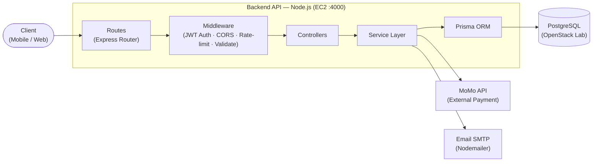
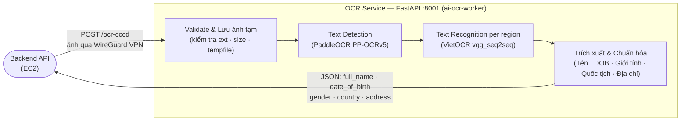
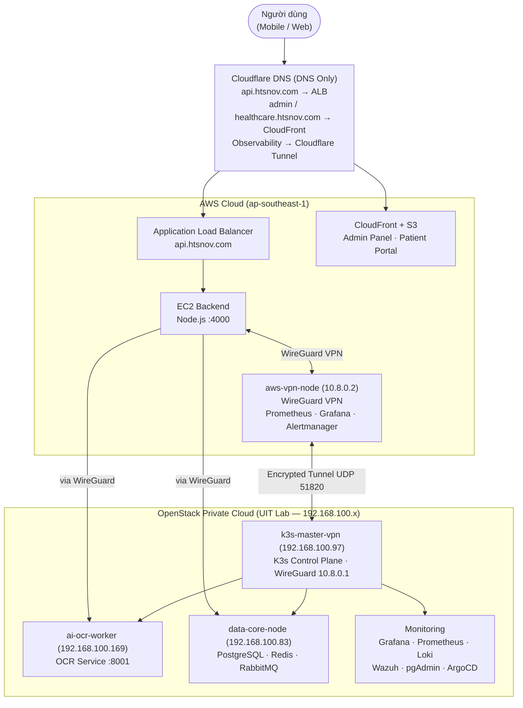
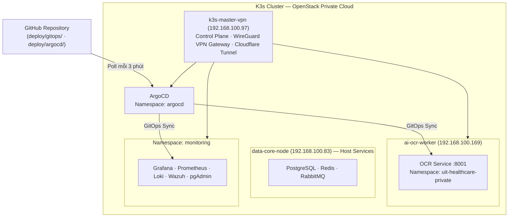
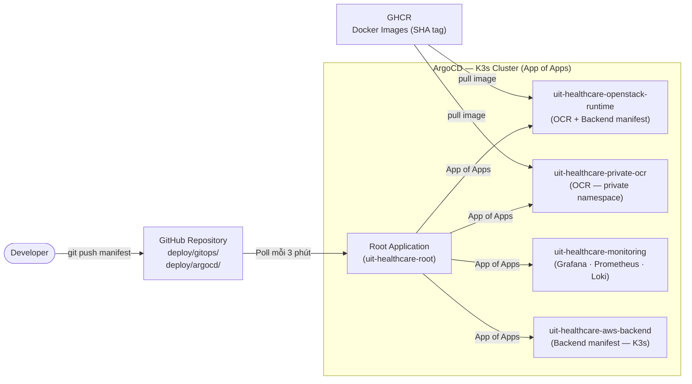
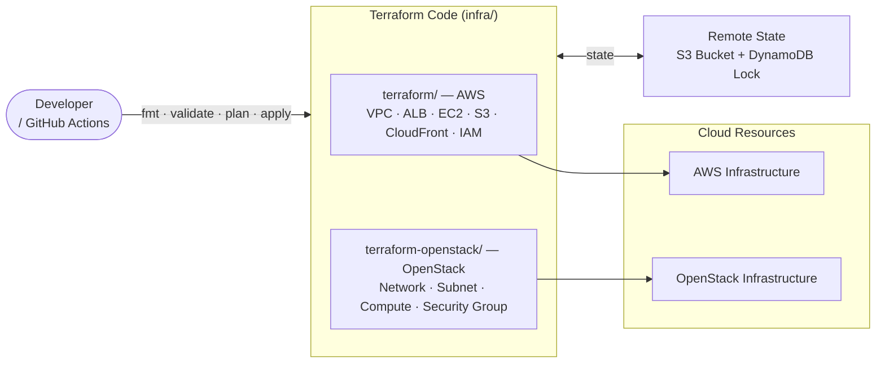
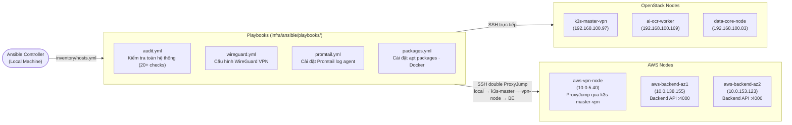
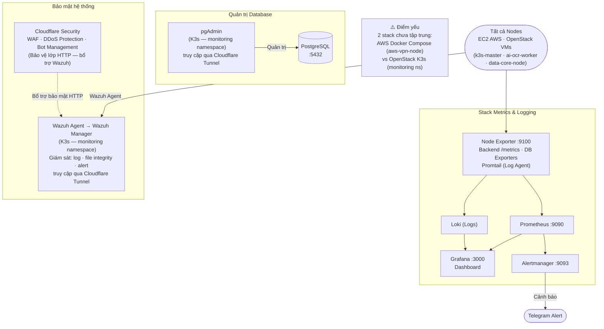
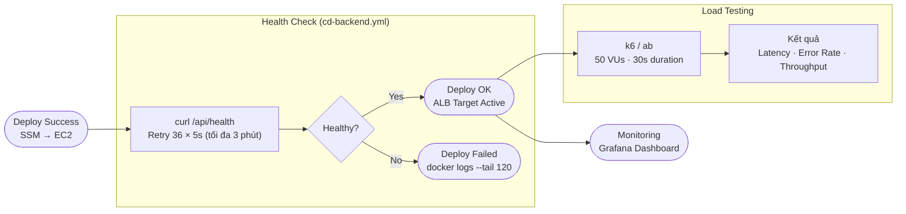

# SƠ ĐỒ BÁO CÁO — UIT Healthcare (Hình 3.5 – 3.13)

> Phiên bản tối giản, tối ưu khổ A4. Nguồn chi tiết tham khảo tại SYSTEM_DIAGRAMS_PART1.md và SYSTEM_DIAGRAMS_PART2.md.

---

## Hình 3.5. Mô hình kiến trúc Backend API

---

## Hình 3.6. Mô hình xử lý OCR Service

---

## Hình 3.7. Mô hình hạ tầng Hybrid Cloud AWS – OpenStack

---

## Hình 3.8. Mô hình Kubernetes/K3s trong OpenStack

---

## Hình 3.9. Mô hình GitOps với ArgoCD

---

## Hình 3.10. Mô hình Infrastructure as Code bằng Terraform

---

## Hình 3.11. Mô hình Ansible Configuration Management

---

## Hình 3.12. Mô hình Monitoring, Logging và Alerting

---

## Hình 3.13. Mô hình Post-deploy Validation và Load Testing

