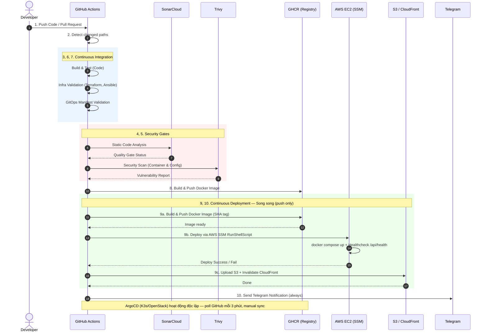
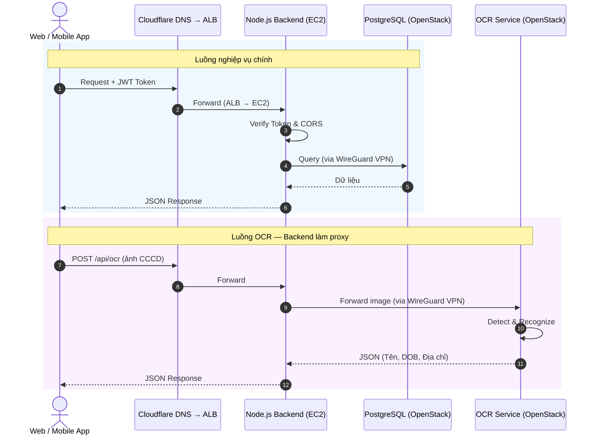
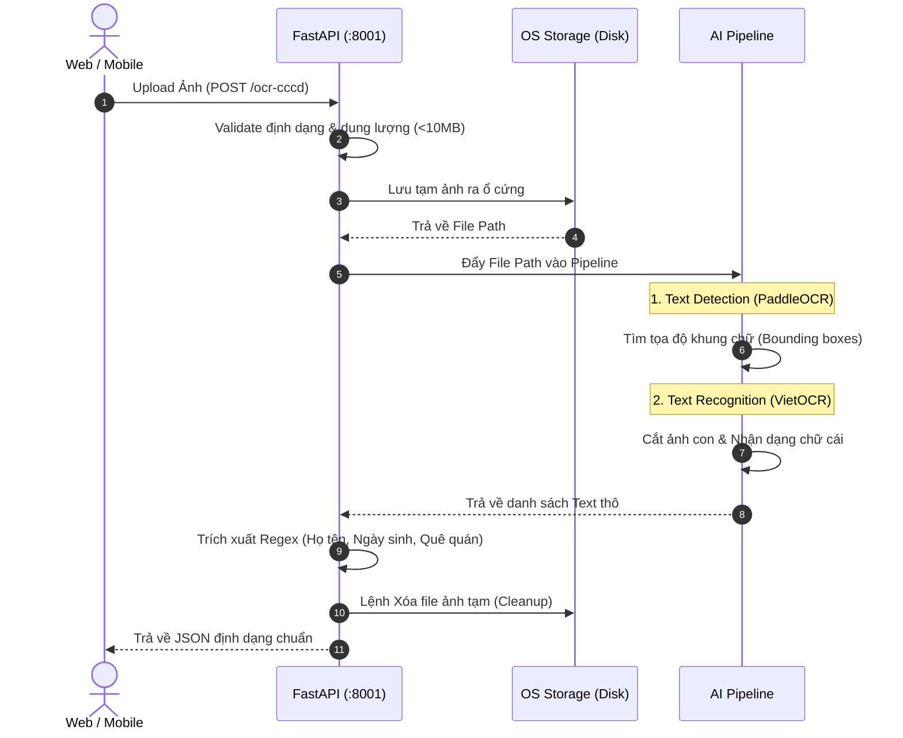

# CÁC SƠ ĐỒ DYNAMIC VIEW (SEQUENCE DIAGRAMS)
Dùng để thay thế cho các sơ đồ luồng (Flowchart) trong báo cáo nhằm tăng tính chuyên nghiệp.

## 1. MÔ HÌNH CI/CD PIPELINE (Thay cho Sơ đồ 1)
Thể hiện rõ ràng 11 bước Pipeline tương tác với các hệ thống bên ngoài theo thứ tự thời gian.

---

## 2. MÔ HÌNH CLIENT GIAO TIẾP API (Thay cho Sơ đồ 3 & 4)
Tách bạch hoàn toàn luồng gửi dữ liệu chữ (về AWS) và luồng gửi ảnh nặng (về OpenStack).

---

## 3. MÔ HÌNH XỬ LÝ BÊN TRONG OCR SERVICE (Thay cho Sơ đồ 6)
Nhờ Sequence Diagram, người chấm bài sẽ thấy rõ vòng đời của tấm ảnh từ lúc bay vào server đến lúc bị xóa đi (Cleanup).

