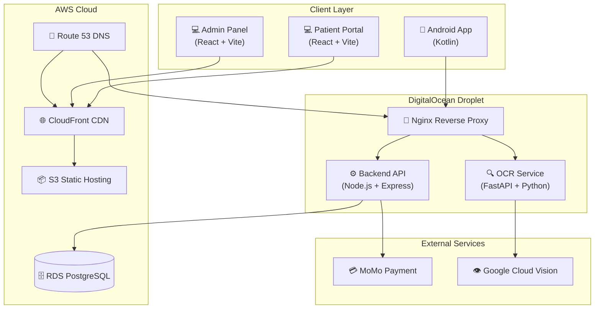
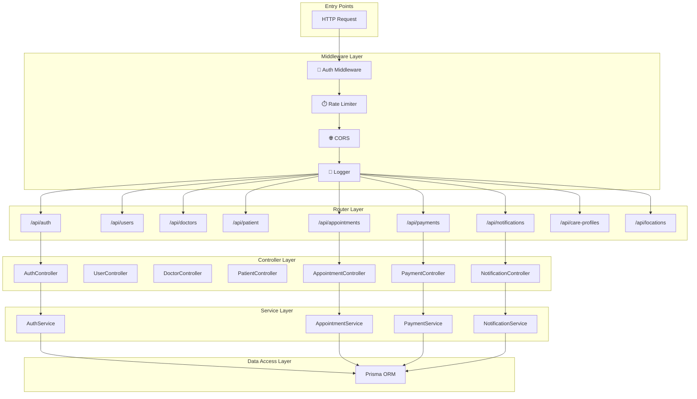
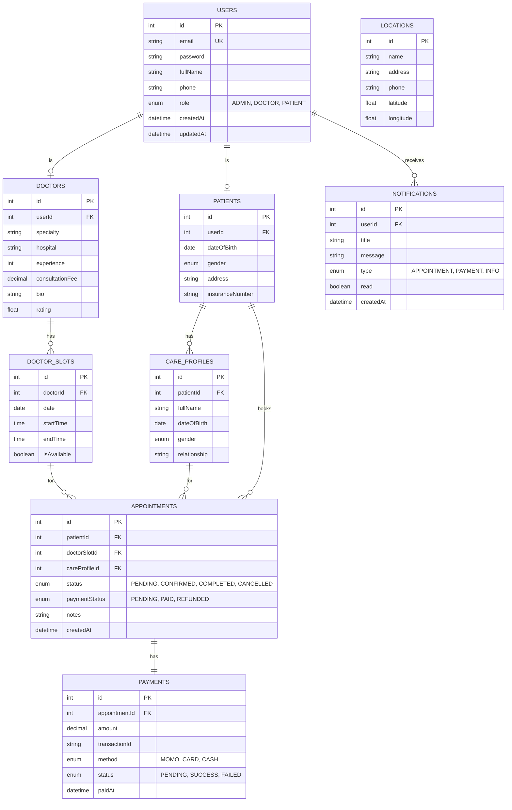
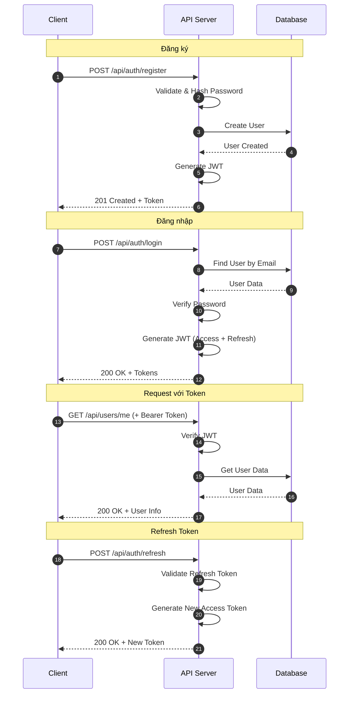
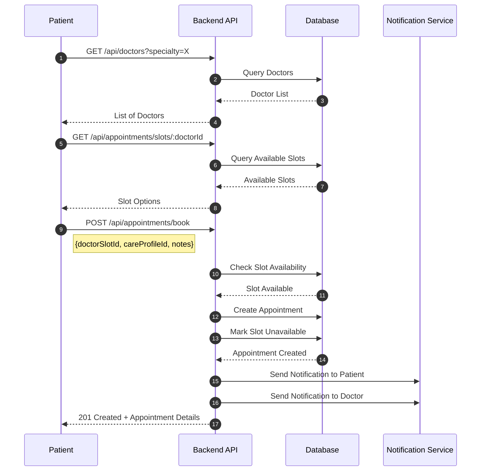
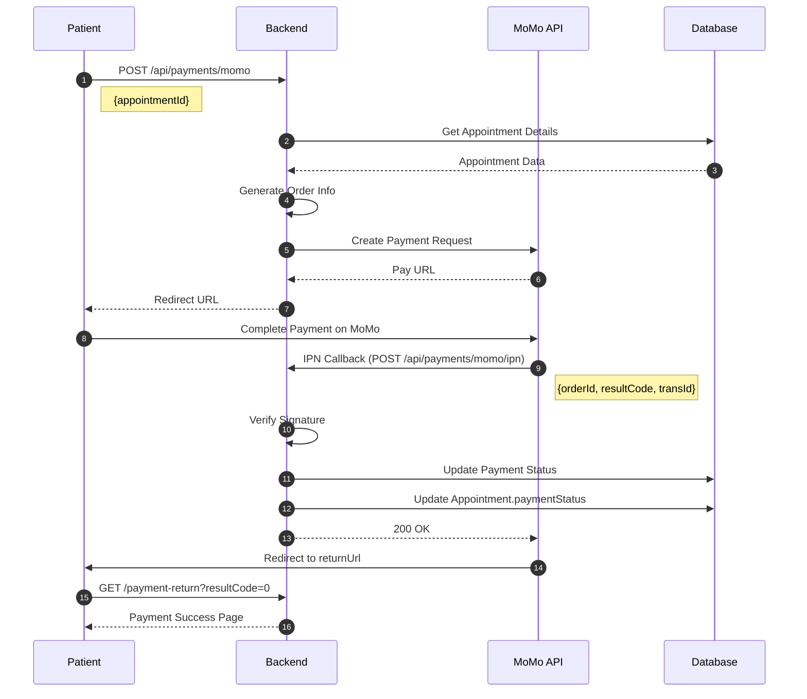
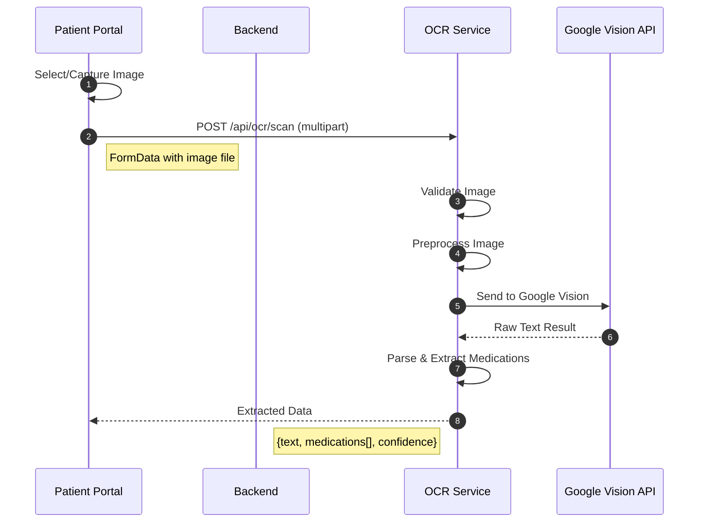
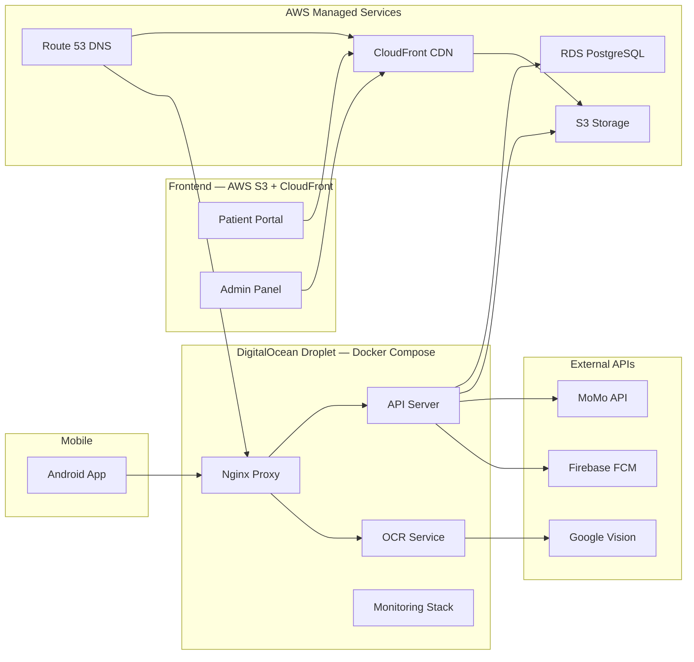
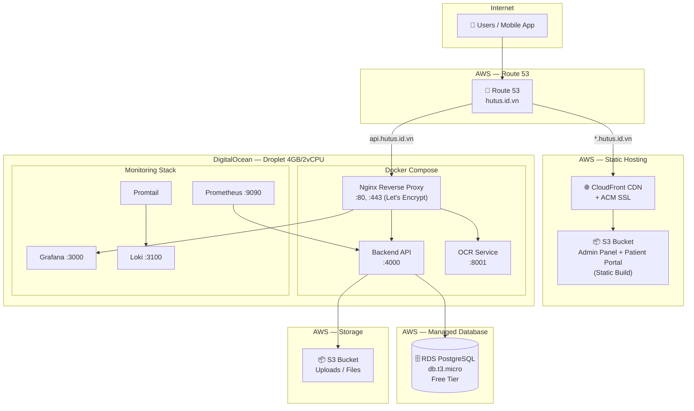
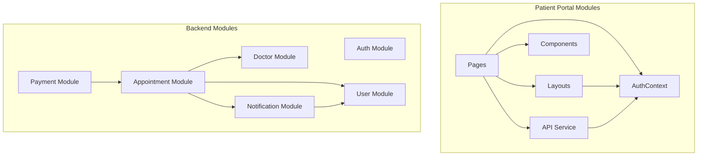

# Sơ đồ Hệ thống - UIT Healthcare

## 1. Tổng quan Kiến trúc Hệ thống

---

## 2. Kiến trúc Backend (Node.js)

---

## 3. Database Schema (ER Diagram)

---

## 4. Authentication Flow

---

## 5. Appointment Booking Flow

---

## 6. Payment Flow (MoMo Integration)

---

## 7. OCR Processing Flow

---

## 8. System Component Diagram

---

## 9. Deployment Architecture (DigitalOcean + AWS)

---

## 10. Module Dependencies

---

## 11. API Endpoints Overview

| Module | Endpoint | Method | Description |
|--------|----------|--------|-------------|
| **Auth** | `/api/auth/register` | POST | Đăng ký tài khoản |
| | `/api/auth/login` | POST | Đăng nhập |
| | `/api/auth/refresh` | POST | Làm mới token |
| **Users** | `/api/users/me` | GET | Lấy thông tin user hiện tại |
| | `/api/users/me` | PUT | Cập nhật thông tin |
| **Doctors** | `/api/doctors` | GET | Danh sách bác sĩ |
| | `/api/doctors/:id` | GET | Chi tiết bác sĩ |
| | `/api/doctors/specialties` | GET | Danh sách chuyên khoa |
| **Appointments** | `/api/appointments/slots/:doctorId` | GET | Lịch trống của bác sĩ |
| | `/api/appointments/book` | POST | Đặt lịch khám |
| | `/api/appointments/:id/cancel` | PUT | Hủy lịch hẹn |
| **Patient** | `/api/patient/profile` | GET/PUT | Hồ sơ bệnh nhân |
| | `/api/patient/appointments` | GET | Lịch hẹn của bệnh nhân |
| **Payments** | `/api/payments/momo` | POST | Tạo thanh toán MoMo |
| | `/api/payments/momo/ipn` | POST | MoMo callback |
| **Notifications** | `/api/notifications` | GET | Danh sách thông báo |
| | `/api/notifications/:id/read` | PUT | Đánh dấu đã đọc |
| **OCR** | `/api/ocr/scan` | POST | Quét đơn thuốc |

---

## 12. Technology Stack Summary

| Layer | Technology | Purpose |
|-------|------------|---------|
| **Mobile** | Kotlin, Android SDK | Native Android app |
| **Web Frontend** | React 19, Vite, TailwindCSS | SPA applications |
| **Backend** | Node.js, Express.js | REST API server |
| **OCR** | Python, FastAPI | AI/ML processing |
| **Database** | PostgreSQL, Prisma ORM | Data persistence |
| **Payment** | MoMo API | Payment processing |
| **Cloud Vision** | Google Cloud Vision | OCR processing |
| **Compute** | DigitalOcean Droplet (4GB/2vCPU) | VPS chạy Docker Compose |
| **Managed DB** | AWS RDS PostgreSQL (Free Tier) | Cloud database |
| **Static Hosting** | AWS S3 + CloudFront | CDN cho frontend SPA |
| **DNS & SSL** | AWS Route 53 + ACM | Domain management |
| **Monitoring** | Prometheus, Grafana, Loki | Metrics & Logging |
| **Containerization** | Docker, Docker Compose, Nginx | Container runtime |
| **CI/CD** | GitHub Actions | Automated deployment |

---

## 13. Chi phí triển khai ước tính (4 tháng)

| Dịch vụ | Cloud | Chi phí/tháng | 4 tháng | Ghi chú |
|---------|-------|---------------|---------|----------|
| Droplet 4GB/2vCPU | DigitalOcean | $24 | $96 | Backend + OCR + Monitoring |
| RDS db.t3.micro | AWS | $0 | $0 | Free Tier 12 tháng |
| S3 (< 5GB) | AWS | $0 | $0 | Free Tier |
| CloudFront (< 1TB) | AWS | $0 | $0 | Free Tier |
| Route 53 | AWS | $0.50 | $2 | 1 hosted zone |
| **Tổng** | | **~$25** | **~$98** | Credit: DO $200 + AWS $200 |
