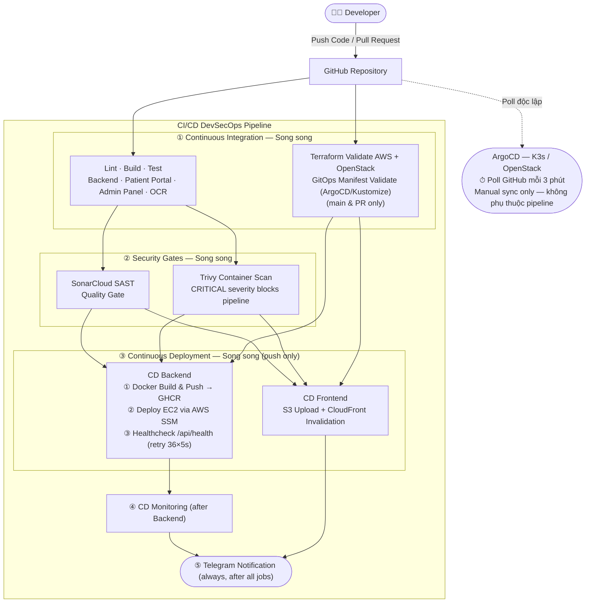
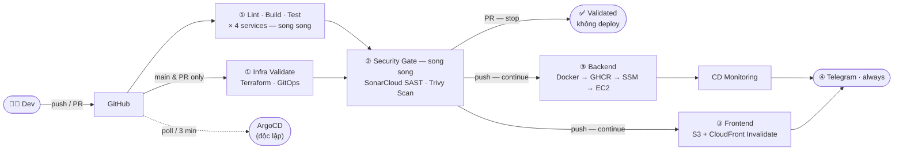
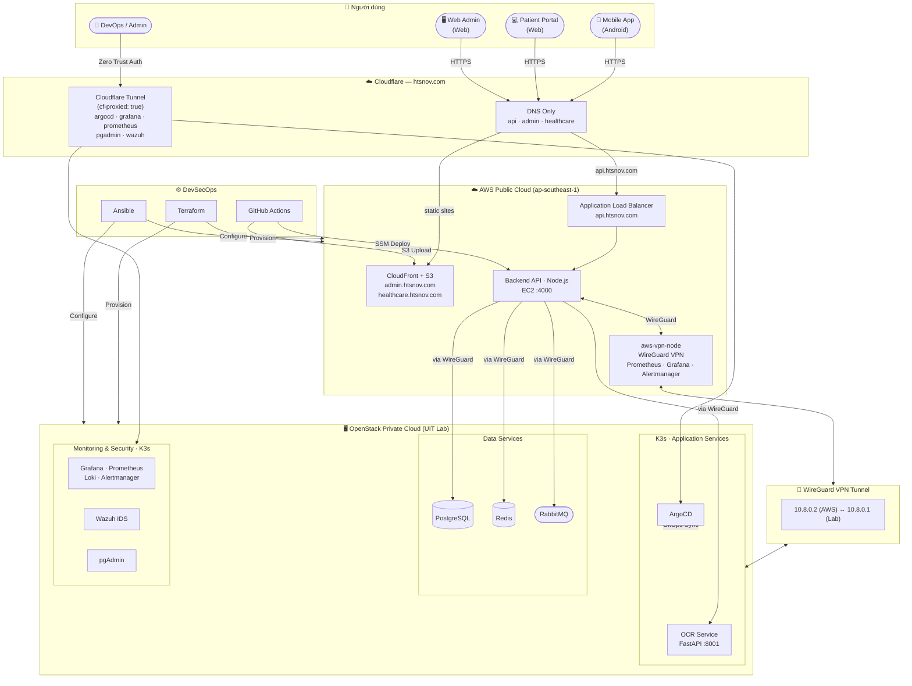
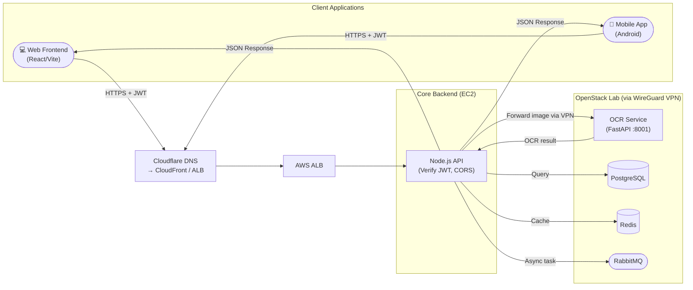
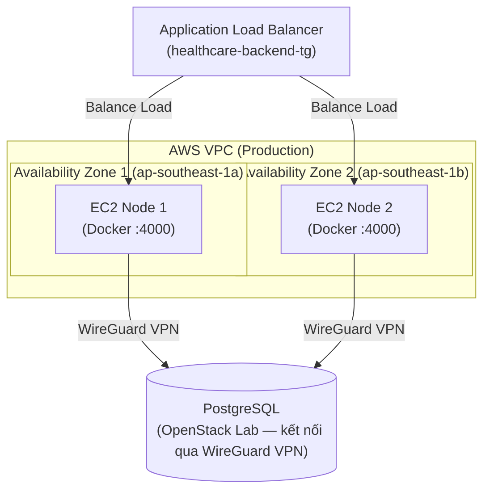

# TỔNG HỢP SƠ ĐỒ HỆ THỐNG UIT HEALTHCARE (C4 Model & Tối ưu Layout)
## Phần 1: CI/CD Pipeline & Kiến trúc Ứng dụng

> **Lưu ý:** Các sơ đồ Mermaid dưới đây đã được tối ưu hóa theo chuẩn C4 Model (Abstraction - giảm bớt chi tiết thừa, gom nhóm bằng Black Box) để dễ dàng xuất ra dạng text cơ bản và làm bản nháp cho bạn vẽ lại trên Draw.io theo tỷ lệ khổ A4.

---

## 1. MÔ HÌNH THIẾT KẾ HỆ THỐNG CI/CD PIPELINE TÍCH HỢP DEVSECOPS

> **Định hướng vẽ Draw.io**: Sơ đồ thể hiện rõ 11 giai đoạn (Stages) của quy trình CI/CD. Khuyến nghị vẽ luồng dọc (Top-Down) và sử dụng chức năng Swimlane hoặc Group của Draw.io để phân tách các khu vực CI, Security, và CD.
> **Kỹ thuật trình bày**: Dùng layout xoay ngang khổ giấy (Landscape) trong file Word để sơ đồ không bị ép nhỏ.



---

## 1b. CI/CD PIPELINE — DẠNG STAGE GATE (Tối giản, khổ A4 ngang)

> Cùng nội dung với Sơ đồ 1 nhưng theo bố cục chuẩn pipeline (trái → phải). Khuyến nghị dùng bản này trong báo cáo với khổ giấy Landscape.



---

## 2. MÔ HÌNH TỔNG THỂ HỆ THỐNG UIT HEALTHCARE

> **Định hướng vẽ Draw.io**: Đây là hình quan trọng nhất. Chia 4 vùng: Client — AWS Public Cloud — OpenStack Private Cloud — DevSecOps. Dùng icon AWS/K8s cho từng service.



---

## 3 & 4. MÔ HÌNH CLIENT (MOBILE/WEB) GIAO TIẾP BACKEND API

> **Định hướng vẽ Draw.io**: Gộp chung Web và Mobile thành Client để tiết kiệm diện tích. Thể hiện luồng gửi Request kèm Token và phân phối qua CDN -> ALB.



---

## 5. MÔ HÌNH KIẾN TRÚC BACKEND API (Mức Component)

> **Định hướng vẽ Draw.io**: Zoom vào khối AWS EC2. Thể hiện kiến trúc High Availability (HA) với 2 Availability Zones (AZ).



---

## 6. MÔ HÌNH XỬ LÝ OCR SERVICE (Luồng Bất Đồng Bộ Đề Xuất)

> **Định hướng vẽ Draw.io**: Sơ đồ này phản ánh thực tế mã nguồn hiện tại, là luồng Synchronous (đồng bộ). Client gửi thẳng ảnh vào API và đợi phản hồi.

```mermaid
flowchart LR
    BE(["Backend API<br>(EC2 — chuyển tiếp từ client)"])
    
    subgraph OPENSTACK ["OpenStack Private Cloud (ai-ocr-worker — 192.168.100.169)"]
        FASTAPI["FastAPI App<br>(OCR Service :8001)"]
        PIPELINE["OCR Pipeline<br>(PaddleOCR + VietOCR)"]
    end
    
    TMP[("Temp File<br>(OS Storage)")]
    
    BE -->|1. POST /ocr-cccd multipart/form-data<br>qua WireGuard VPN| FASTAPI
    FASTAPI -->|2. Validate ext + size| TMP
    FASTAPI -->|3. detect(img) — PaddleOCR PP-OCRv5_mobile_det| PIPELINE
    PIPELINE -->|4. recog() — crop region → VietOCR vgg_seq2seq| PIPELINE
    PIPELINE -->|5. extract_full_name / dob / gender / address| FASTAPI
    FASTAPI -->|6. JSON: full_name · date_of_birth · gender · country · address| BE
```

---
> **Mẹo triển khai**: Bạn hãy xuất code Mermaid này ra dạng text cơ bản, sau đó copy dán vào Draw.io (chức năng `Arrange > Insert > Advanced > Mermaid...`). Sau khi Draw.io sinh ra bộ khung, bạn được quyền tự do kéo thả các Node, thay các ô vuông mặc định bằng bộ Icon chuẩn của AWS, Kubernetes và OpenStack, thêm bảng chú giải (Legend) để thay cho các khối văn bản dài dòng. Chúc bạn hoàn thành báo cáo thật xuất sắc!
