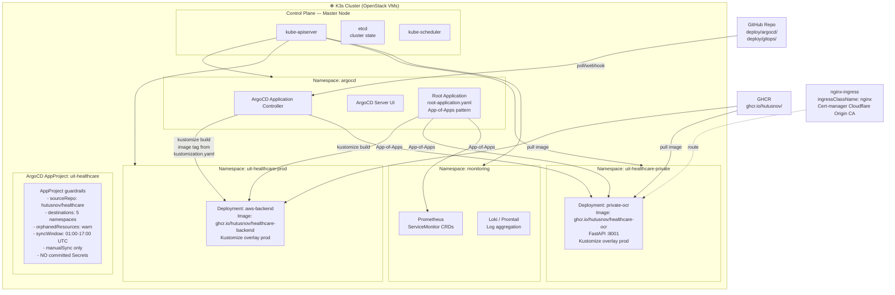
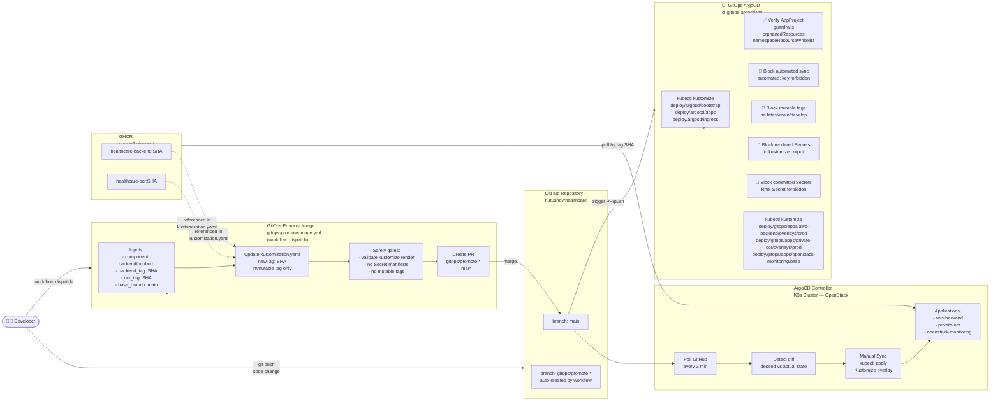
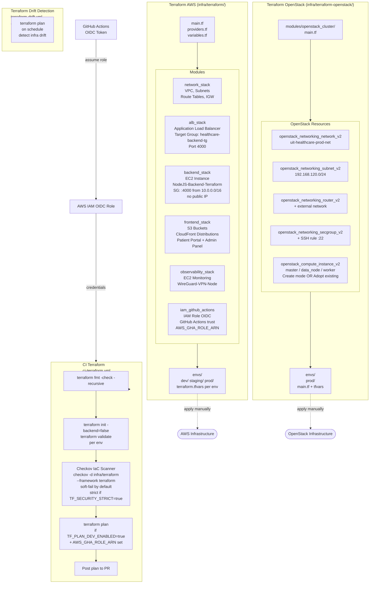
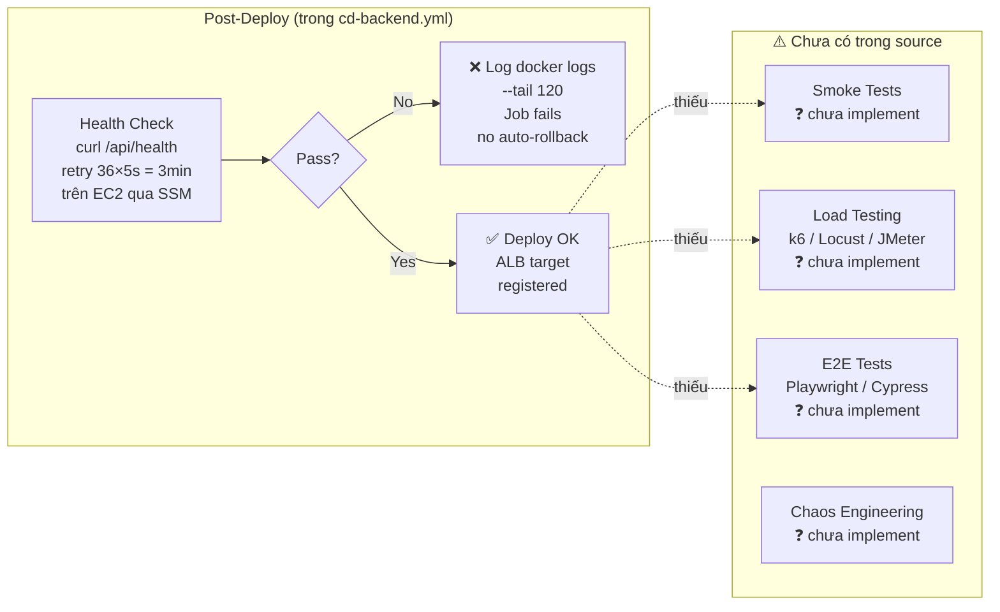

# TỔNG HỢP SƠ ĐỒ HỆ THỐNG UIT HEALTHCARE
## Phần 2: Hạ tầng & Operations

> Nguồn: `infra/terraform/`, `infra/terraform-openstack/`, `infra/ansible/`, `deploy/argocd/`, `deploy/gitops/`, `cd-monitoring.yml`

---

## 7. MÔ HÌNH HẠ TẦNG HYBRID CLOUD AWS – OPENSTACK

> **Nguồn**: `infra/terraform/modules/`, `infra/terraform-openstack/modules/openstack_cluster/main.tf`, `deploy/argocd/bootstrap/healthcare-project.yaml`, Ansible inventory.
> ✅ **Đã xác nhận**: Node IPs từ `infra/ansible/inventory/hosts.yml`. WireGuard: `aws-vpn-node (10.8.0.2)` ↔ `k3s-master-vpn (10.8.0.1)`. DB = PostgreSQL trên Lab. Cloudflare là DNS primary trước CloudFront.

```mermaid
flowchart TB
    INTERNET([🌐 Internet\nPublic Traffic]) 

    GHCR[GHCR — GitHub Container Registry\nghcr.io/hutusnov/\nhealthcare-backend\nhealthcare-ocr]

    CF_DNS[☁️ Cloudflare DNS Only\nKhông bật Proxy\napi.htsnov.com → ALB\nadmin/healthcare.htsnov.com → CloudFront]

    subgraph AWS ["☁️ AWS Cloud (ap-southeast-1)"]
        direction TB
        subgraph VPC ["VPC 10.0.0.0/16"]
            subgraph PUBLIC_SUBNET ["Public Subnet"]
                IGW[Internet Gateway]
                ALB[Application Load Balancer\nhealthcare-backend-tg\nPort 4000]
                CF_DIST[CloudFront Distributions\nPatient Portal + Admin Panel]
            end
            subgraph PRIVATE_SUBNET ["Private Subnet"]
                EC2_BE[EC2: NodeJS-Backend-Terraform\nhealthcare-backend-sg-tf\nPort 4000 inbound from 10.0.0.0/16]
                EC2_MON[EC2: aws-vpn-node (10.0.5.40)\nWireGuard VPN Client (10.8.0.2)\nMonitoring: Prometheus:9090 · Grafana:3000 · Alertmanager:9093]
            end
            S3_BUCKETS[S3 Buckets\nPatient Portal\nAdmin Panel\nStatic Assets]
            SSM[AWS Systems Manager\nSSM Agent\nDeploy via RunShellScript]
            IAM_OIDC[IAM Role OIDC\nAWS_GHA_ROLE_ARN\nGitHub Actions trust]
        end
    end

    subgraph OPENSTACK ["🖥️ OpenStack Private Cloud (UIT Infrastructure)"]
        direction TB
        subgraph OS_NET ["Network — 192.168.100.x (UIT Lab)"]
            OS_ROUTER[OpenStack Router\n+ External Network\nFloating IP]
            OS_SG[Security Group\nuit-healthcare-prod-sg]
            K3S_MASTER[k3s-master-vpn (192.168.100.97)\nK3s Control Plane\nWireGuard Server (10.8.0.1) · Cloudflare Tunnel]
            K3S_DATA[data-core-node (192.168.100.83)\nK3s Worker\nArgoCD · Grafana · Loki · Wazuh Manager]
            K3S_WORKER[ai-ocr-worker (192.168.100.169)\nK3s Worker · OCR Service (:8001)]
            PG_DB[("PostgreSQL\nLab Database")]
        end
        KEYPAIR[OpenStack Keypair\nSSH Access]
    end

    subgraph WG ["🔐 WireGuard VPN Tunnel (10.8.0.0/24)"]
        WG_NOTE[aws-vpn-node (10.8.0.2) ↔ k3s-master-vpn (10.8.0.1)\nPort 51820 UDP · /etc/wireguard/wg0.conf]
    end

    INTERNET --> CF_DNS
    CF_DNS -->|api.htsnov.com — trực tiếp| ALB --> EC2_BE
    CF_DNS -->|admin/healthcare.htsnov.com| CF_DIST --> S3_BUCKETS
    IGW -.->|AWS Internet Gateway| ALB
    EC2_BE -->|PostgreSQL via WireGuard| PG_DB
    SSM -->|RunShellScript| EC2_BE
    SSM -->|RunShellScript| EC2_MON
    IAM_OIDC -->|OIDC JWT| SSM
    GHCR -->|docker pull| EC2_BE
    GHCR -->|image pull via ArgoCD| K3S_WORKER
    EC2_MON <-->|WireGuard| WG <-->|WireGuard| K3S_MASTER
    OS_ROUTER --> OS_NET
    OS_SG --> K3S_MASTER
    OS_SG --> K3S_DATA
    OS_SG --> K3S_WORKER
    K3S_MASTER --- K3S_DATA
    K3S_MASTER --- K3S_WORKER
```

---

## 8. MÔ HÌNH KUBERNETES/K3s TRONG OPENSTACK

> **Nguồn**: `deploy/argocd/bootstrap/healthcare-project.yaml`, `deploy/gitops/apps/`, `infra/ansible/playbooks/audit.yml` (k3s checks), `ci-gitops-argocd.yml`.
> ⚠️ **Thiếu thông tin một phần**: Không có K3s manifest YAML cụ thể (`values.yaml`, `Deployment.yaml` của từng service). Các resource limits, replicas, ingress rules chưa rõ. Chỉ biết namespaces và app paths từ ArgoCD config.



**Namespaces được phép trong AppProject**:
| Namespace | Mục đích |
|-----------|----------|
| `argocd` | ArgoCD system |
| `uit-healthcare` | Dev environment |
| `uit-healthcare-prod` | Production backend |
| `uit-healthcare-private` | Private OCR service |
| `monitoring` | Prometheus / Loki |

---

## 9. MÔ HÌNH GITOPS VỚI ARGOCD

> **Nguồn**: `ci-gitops-argocd.yml`, `gitops-promote-image.yml`, `deploy/argocd/bootstrap/`, `deploy/gitops/apps/*/overlays/prod/`.
> ✅ Đầy đủ thông tin, vẽ được hoàn toàn.



---

## 10. MÔ HÌNH INFRASTRUCTURE AS CODE BẰNG TERRAFORM

> **Nguồn**: `infra/terraform/` (AWS), `infra/terraform-openstack/` (OpenStack), `ci-terraform.yml`, `terraform-drift.yml`.
> ✅ Đầy đủ thông tin, vẽ được.



---

## 11. MÔ HÌNH ANSIBLE CONFIGURATION MANAGEMENT

> **Nguồn**: `infra/ansible/playbooks/`, `infra/ansible/ansible.cfg`, `infra/ansible/roles/`.
> ✅ **Đã đọc được `inventory/hosts.yml`**. Roles: wireguard, promtail. SSH dùng ForwardAgent + ProxyJump qua k3s-master → aws-vpn-node → BE nodes.

```mermaid
flowchart TB
    subgraph ANSIBLE_CTRL ["💻 Ansible Controller\n(Local / CI machine)"]
        CFG[ansible.cfg\nremote_user: ubuntu\npipelining: true\nForwardAgent: yes]
        INV[inventory/hosts.yml\n⚠️ file chứa IP thật\nkhông commit public]
        PLAYS[Playbooks]
        ROLES[Roles\n⚠️ nội dung chưa đọc]
    end

    subgraph PLAYBOOKS ["📋 Playbooks"]
        SITE[site.yml\nEntry point\nhosts: all]
        PKGS[packages.yml\napt packages\nDocker / K3s / etc]
        WG[wireguard.yml\nWireGuard VPN setup\n/etc/wireguard/wg0.conf]
        PROMTAIL[promtail.yml\nPromtail log agent\n/etc/promtail/config.yaml]
        AUDIT[audit.yml\nFull system audit\n20+ checks per node]
    end

    subgraph AUDIT_CHECKS ["📊 Audit Checks (audit.yml)"]
        direction LR
        A1[System Info\nOS/Kernel/CPU/RAM/IP]
        A2[Systemd Services\nrunning + enabled]
        A3[Docker\ncontainers + compose]
        A4[K3s + Helm\nnodes + pods + releases]
        A5[ArgoCD Apps\nhealth + sync status]
        A6[Listening Ports\nss -tlnp]
        A7[Security\nSSH config\nFail2ban\niptables/nftables/UFW]
        A8[Monitoring Agents\nNode Exporter :9100\nWazuh Agent\nSSM Agent\nCloudflared Tunnel]
        A9[Config Files\nWireGuard\nPromtail\nPrometheus]
    end

    subgraph TARGET_NODES ["🖥️ Target Nodes (SSH)"]
        EC2_BE_NODE[AWS EC2 Backend\nubuntu@IP:22]
        EC2_MON_NODE[aws-vpn-node\nubuntu@10.0.5.40 (via ProxyJump)]
        OS_MASTER[k3s-master-vpn\nubuntu@192.168.100.97]
        OS_DATA[data-core-node\nubuntu@192.168.100.83]
        OS_WORKER[ai-ocr-worker\nubuntu@192.168.100.169]
    end

    OUTPUT["/tmp/audit-report/\n{hostname}.txt\nINDEX.txt\n(saved locally)"]

    CFG --> INV --> PLAYS
    PLAYS --> SITE --> PKGS
    PLAYS --> WG
    PLAYS --> PROMTAIL
    PLAYS --> AUDIT
    AUDIT --> AUDIT_CHECKS
    AUDIT_CHECKS --> OUTPUT

    INV -->|SSH\nForwardAgent| TARGET_NODES
    PKGS -.-> TARGET_NODES
    WG -.-> EC2_MON_NODE
    PROMTAIL -.-> TARGET_NODES
    AUDIT -.-> TARGET_NODES
```

---

## 12. MÔ HÌNH MONITORING, LOGGING VÀ ALERTING

> **Nguồn**: `cd-monitoring.yml` (Docker Compose inline), `infra/ansible/playbooks/audit.yml` (node_exporter, promtail, wazuh checks).
> ⚠️ **Thiếu thông tin**: Loki/Grafana Loki stack chỉ thấy Promtail agent (từ Ansible), không có Loki server config. Wazuh Manager endpoint không rõ. Dashboard Grafana IDs không có trong source.

```mermaid
flowchart TB
    subgraph METRICS ["📊 Metrics Pipeline"]
        direction LR
        BE_METRICS[Backend EC2\n/metrics endpoint\n:4000/metrics]
        NODE_EXP[Node Exporter\n:9100/metrics\nHW metrics]

        PROM[Prometheus\nprom/prometheus:v2.53.0\n:9090\nretention: 7d\nscrape: 30s]

        GRAFANA[Grafana\ngrafana/grafana:11.1.0\n:3000\ndatasource: Prometheus\nauth: admin/env]

        ALERTMGR[Alertmanager\nprom/alertmanager:v0.27.0\n:9093\ngroupBy: alertname+service\nrepeat: 2h]
    end

    subgraph ALERT_RULES ["🚨 Alert Rules (alert-rules.yml)"]
        RULE1[BackendDown\nexpr: max_over_time sum up\nfor: 5m\nseverity: critical]
    end

    subgraph LOG_PIPELINE ["📋 Logging Pipeline"]
        PROMTAIL_AGENT[Promtail Agent\n/etc/promtail/config.yaml\nlog scrape → push to Loki\n⚠️ Loki server không rõ endpoint]
        LOKI_SRV[Loki Server\n(K3s — monitoring namespace)]
    end

    subgraph SECURITY_MON ["🔒 Security Monitoring"]
        WAZUH[Wazuh Agent\n/var/ossec/\nIDS / log analysis\n⚠️ Manager endpoint không rõ]
        WAZUH_MGR[Wazuh Manager\n(K3s — monitoring namespace)]
    end

    subgraph NOTIFICATIONS ["📬 Notifications"]
        EMAIL[Email Alert\nGmail SMTP :587\nsmtp.gmail.com\nALERT_EMAIL_TO env]
        TELEGRAM[Telegram Bot\nCI/CD results\nappleboy/telegram-action]
    end

    subgraph TARGETS ["🖥️ Monitored Targets"]
        EC2_BE_T[EC2 Backend\ntag: Project=uit-healthcare\ntag: Component=backend]
        SELF_PROM[Prometheus self\nlocalhost:9090]
    end

    EC2_BE_T --> BE_METRICS --> PROM
    EC2_BE_T --> NODE_EXP --> PROM
    PROM --> GRAFANA
    PROM --> ALERTMGR
    PROM --> RULE1
    RULE1 -->|trigger| ALERTMGR
    ALERTMGR --> EMAIL
    SELF_PROM --> PROM

    EC2_BE_T --> PROMTAIL_AGENT --> LOKI_SRV
    GRAFANA -.->|Loki datasource| LOKI_SRV
    EC2_BE_T --> WAZUH --> WAZUH_MGR

    TELEGRAM -.->|CI/CD events| DEV([DevOps Team])
    EMAIL -.->|BackendDown alert| DEV
```

**Stack Monitoring được deploy** (từ `cd-monitoring.yml`):
| Service | Image | Port | Volume |
|---------|-------|------|--------|
| Prometheus | `prom/prometheus:v2.53.0` | 9090 | prometheus_data |
| Grafana | `grafana/grafana:11.1.0` | 3000 | grafana_data |
| Alertmanager | `prom/alertmanager:v0.27.0` | 9093 | — |

---

## 13. MÔ HÌNH POST-DEPLOY VALIDATION VÀ LOAD TESTING

> ⚠️ **THIẾU THÔNG TIN — KHÔNG VẼ ĐƯỢC ĐẦY ĐỦ**
> 
> Không tìm thấy workflow hoặc script nào trong source code thực hiện:
> - Post-deploy validation (smoke test, E2E test sau deploy)
> - Load testing (k6, Locust, JMeter, Artillery)
> 
> **Những gì có trong source liên quan**:
> - Health check tích hợp trong `cd-backend.yml`: `curl -fsS http://127.0.0.1:4000/api/health` (retry 36 lần × 5s = 3 phút max)
> - Health check monitoring: `curl -fsS http://127.0.0.1:9090/-/ready && curl -fsS http://127.0.0.1:3000/api/health`
> - File `test-all-features.sh` tồn tại nhưng không đọc nội dung chi tiết
> - File `TestGuide.md` tồn tại
>
> **Sơ đồ một phần** (dựa trên những gì biết được):



---

## TỔNG HỢP THÔNG TIN THIẾU (⚠️ Cần bổ sung)

| Sơ đồ | Thông tin thiếu | Nguyên nhân |
|--------|----------------|-------------|
| #3 Mobile App | Source Android (`APP-ANDROID/`), màn hình cụ thể, Retrofit config | Thư mục không có file đọc được |
| #4 Web Frontend | Source React components, routing, state management | `patient-portal/` và `admin-panel/` nằm sâu trong `BACK-END/PROJECT-TEST/` |
| #5 Backend API | Cấu trúc folder `src/`, route files `.js`, middleware chain | Chỉ có `package.json`, không có source JS |
| #7 Hybrid Cloud | IP thật của nodes, floating IPs, WireGuard peers | Secrets không commit |
| #8 K3s | Deployment manifests, resource limits, replicas, Ingress rules | Chưa có K8s YAML cụ thể |
| #11 Ansible | `inventory/hosts.yml` IPs, nội dung `roles/` | Inventory chứa credentials |
| #12 Monitoring | Loki server config, Wazuh Manager endpoint, Grafana dashboards | Không tìm thấy trong source |
| #13 Post-deploy | Smoke tests, load testing, E2E, rollback strategy | Chưa implement trong workflows |
